= The LOTUS Initiative
:toc:

== Introduction

*LOTUS*, actually, consists of

include::docs/metrics.adoc[]

It represents the most exhaustive resource of documented structure-organism pairs.

Within the frame of current computational approaches to guide Natural Produts’s research and related fields, all these elements should allow a more complete understanding of organisms and their chemistry.

== Data Availability Statements

The data used to support the findings of this study have been deposited on OSF https://osf.io/pmgux/[https://osf.io/pmgux/].
An snapshot of the repository at the time of publication is also available.

== Dataset list

All data used for this study is listed under xref:docs/dataset.csv[docs/dataset.csv]

== Requirements

You need:

- R
- Python
- Java >= 15
- Git
- Conda

- If you want to be able to use the xref:../src/2_curating/2_editing/reference/1_translating/pubmed.R[PMID translation script] with less limitations and it to work correctly, you have to set an API key as described in the following https://cran.r-project.org/web/packages/rentrez/vignettes/rentrez_tutorial.html[vignette]

== Programs use

=== Description

== Getting started

=== Instructions

These instructions will get you a copy of the project up and running on your local machine for development and testing purposes.

==== Clone the repository

[source,console]
----
git clone git@gitlab.com:lotus7/lotus-processor.git
----

==== Having the data in a different place

If you want to have the data in a different place (for example for running a test), you can set the environment variable **DATA_PATH**.

==== Use docker to build

Install docker on your machine, make sure it is on your path then.
## WORKING ONLY ON LINUX FOR NOW

[source,console]
----
make docker-build
make docker-bash
----

This will bring you in a container that will already have all the dependencies installed so you can run your commands in it.

==== Additional MAKE Readme

If you want more informations regarding how to use MAKE, please have a look at xref:docs/makefile.adoc[the specific documentation]

==== Conda environement

A "loose" environment.yml file is created and should allow to recreate a working env from he project without beeing too restrictive on the versions to install.
Install it by running in the home directory.

environment_strict.yml is corresponds to the exact versions we used.

If your environement is not directly sources by your default bash run the following lines

[source,console]
----
source ~/anaconda3/etc/profile.d/conda.sh
conda env create -f environment.yml
conda activate lotus_env
bash environment_non_conda.sh
----

==== Running the tests

First, you need some additional executable files.
Following line will help you getting them.

[source,console]
----
make get-bins
----

Then, you need the data and our custom dictionaries.

[source,console]
----
make gathering-databases-download # downloads acessible databases &&
# make gathering-databases-scrape && # scrapes some other databases, very long step and sometimes servers are not available
make gathering-databases-download-modified && # downloads some manually modified versions of acessible databases or files we had to correct in a non-programmatic way.
make gathering-custom-dictionaries &&
# TODO add for translations
# Then, you need to convert the format of some of them and start harmonizing the data
make gathering-databases-convert &&
make gathering-databases-integrate &&
make gathering-databases
----

Globally, you can run this as an easier equivalent:

[source,console]
----
make gathering-databases-full-quick
----

Now, you should be able to process all this data.
For all details about the MAKE commands, please have a look at xref:docs/makefile.adoc[the specific documentation].
To start easy, you can run our tests:

[source,console]
----
make MODE=test curating-and-analysing-and-visualizing # creating results for a test file, should fail at the last visualization step.
make tests ## comparing if tests meet expctations # should fail actually
----

Once we will be releasing not only the tests but also the min table (1000 entries), users will be able to run (not working now):

[source,console]
----
make MODE=min curating-and-analysing-and-visualizing
----

= Makefile README

This is a quick guide concerning the use of `make`.

== Instructions

=== Mode

First of all, you can choose between the minimal working example `MIN` or making the whole DB `FULL`.
By defaut make will run the `MIN` example for tests.
To override it, simply do:

[source,console]
----
make MODE=full <target>
----

=== Docker

The `docker-build` and `docker-bash` commands are for our CI integration, and may be useful if you want to use our custom docker environment.

`docker-build` will build a docker image than you can enter using docker-bash.
The advantage is that you are sure to have the right versions of everything in your image, as it can sometimes be difficult to reproduce other people's environments.

=== Gathering the data

First, you need to perform the `gathering` of your initial data.
To do so, you have multiple options:

* `gathering-full` will perform *all* gathering steps (*long*)
* `gathering-databases-full` will perform *all* databases related gathering steps (*long*).
For a quicker version once you performed gathering all sub-steps simply do `gathering-databases`.
* `gathering-translation-full` will perform *all* translation dictionaries related gathering steps.

=== Curating the data

Once done, you can do the `curating` steps of your initial data.
The following command will run all the curation tasks:

[source,console]
----
make curating
----

`curating` is divided in three steps:

* `curating-1-integrating`: integrates all previously gathered data
* `curating-editing`: will perform the editing (cleaning) of the data through the three following steps:
** `curating-editing-structure`: will perform the curation of the structures
** `curating-editing-organism`: will perform the curation of the organisms
** `curating-editing-reference`: will perform the curation of the references
* `curating-3-integrating`: will perform the integration of cleaned data with initial data

Each curation step for each object is divided in more substeps.
Fore more advanced details please see link:../Makefile[the makefile].

=== Analysing the data

After curation, results can be analysed:

[source,console]
----
make analysing
----

=== Visualizing the data

As a final step, figures can be reproduced using:

[source,console]
----
make visualizing
----

=== tl;dr

To perform all steps except gathering of the data in one shot:

[source,console]
----
make curating-and-analysing-and-visualizing
----

additional details about the command arguments can be found https://www.gnu.org/software/make/manual/make.html#Options-Summary[here]

== More info

If you want to know more about how a Makefile works, simply visit https://www.gnu.org/software/make/manual/make.html

== Miscellaneous

=== Molconvert issue

At the moment, we use molconvert (commercial) for structure to chemical name conversion.
Since we cannot disseminate it, you won't be able to proceed to the translation except if you modify following variables in src/paths.R accordingly:

[source,console]
----
works_locally_only <- TRUE // FALSE
molconvertPath <- adapt_path_to // "~/../../Applications/MarvinSuite/bin/molconvert"
----

=== To build the flowchart

[source,console]
----
yarn global add @mermaid-js/mermaid-cli

mmdc -i docs/flowchart.mmd -o img/flowchart.svg
----

See https://github.com/mermaid-js/mermaid-cli for more info

== Frequently Asked Questions (FAQ)

* "I have parallelization issues on my Windows."
** Sorry we suggest using a Linux machine instead.

* "I have parallelization issues on my macOS."
** Try adding the following to your .bash/zshrc file:

[source]
----
export OBJC_DISABLE_INITIALIZE_FORK_SAFETY=YES

export DISABLE_SPRING=true
----

== References

To do

== Contributing

Please read xref:CONTRIBUTING.md[contributing] for details on our code of conduct, and the process for submitting pull requests to us.

== Authors

- *Adriano Rutz* - _Initial work_ - https://gitlab.com/Adafede[Adafede]
- *Pierre-Marie Allard* - _Investigator_ - https://gitlab.com/oolonek[oolonek]
- *Jonathan Bisson* - _Hacker in Chief_ - https://gitlab.com/bjonnh[bjonnh]

See also the list of https://gitlab.com/lotus7/lotus-processor/-/project_members[contributors] who participated in this project.

== Acknowledgments

- Hat tip to anyone whose code was used
- Inspiration
- etc.

== License

This project is licensed under the GNU GPLv3 license - see the xref:LICENSE.md[license file] for details
