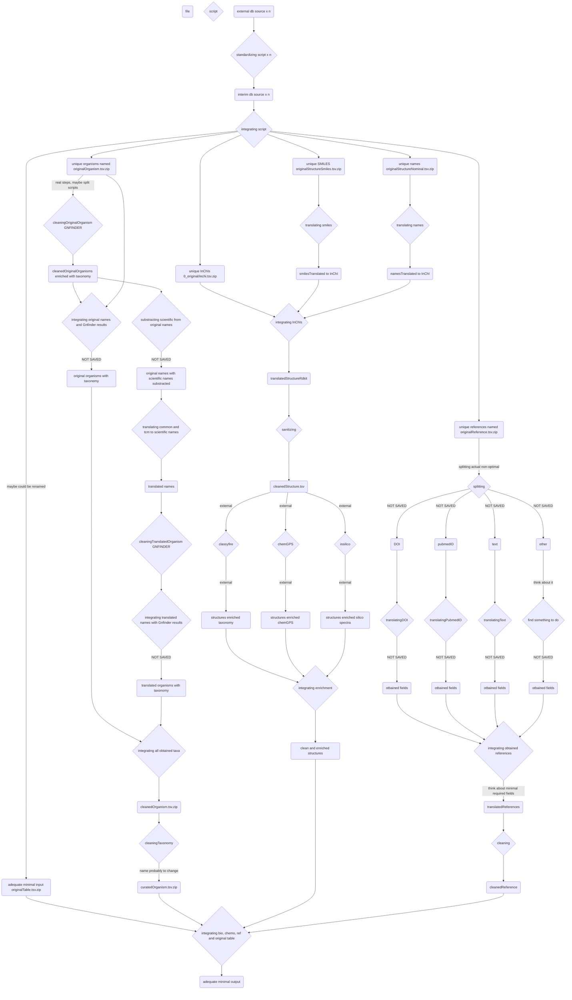

# OpenNPDB: an Open Natural Products Database

*OpenNPDB:* an Open Natural Products Database. Actually, this database (DB) consists of XXX'XXX structure - organism pairs, gathered and standardized among XX open DB’s. It represents the most exhaustive open DB for natural products (NP’s) dereplication. It encompasses XXX'XXX distinct structures in XX’XXX resolved organisms. Additionally, both chemical and biological taxonomy are given for each pair. Other basic chemical descriptors and in silico tandem mass spectrometry (MS/MS) spectrum are provided for each structure. Within the frame of current computational approaches to guide NP’s research, all these elements should allow a more complete understanding of organisms and their metabolites.


## Flowchart



## Getting Started

These instructions will get you a copy of the project up and running on your local machine for development and testing purposes.

### Prerequisites

You need Git, [DVC](https://www.dvc.org).

You need to have access to the metabomaps server to be able to pull the data, if you don't you will have to pull all the DBs data
from scratch.

### Access to metabomaps

Add this to your ~/.ssh/config

```
Host metabomaps
  IdentityFile /home/<user_local>/.ssh/id_rsa_metabomaps
  User <user_remote>
  HostName metabomaps.nprod.net
  Port 10311
```

### Pull the repository

```console
git pull https://gitlab.unige.ch/Adriano.Rutz/opennaturalproductsdb.git

# If you need the data
dvc pull  # This will take a while
```

### Having the data in a different place

If you want to have the data in a different place (for example for running a test), you can set the environment variable **DATA_PATH**.

### If you want to build only a simple DB

make -C src/1_gathering/db -B alkamid 


### Use docker to build

Install docker on your machine, make sure it is on your path

then

````console
make docker-build
make docker-bash
````

This will bring you in a container that will already have all the dependencies installed so you can run your commands in it.


# TO UPDATE

```
Give examples
```

### Packages

#### Conda environement

A "loose" environment_loose.yml file is created and should allow to recreate a working env formthe project without beeing too restrictive on the versions to install.
Install it by running in the home directory. Else use the environment_notloose.yml for strict mirroring of the installed packages.

````
conda env create -f environment_loose.yml
````

If your environement is not directly sources by your default bash run the following lines

````
$ source ~/anaconda3/etc/profile.d/conda.sh

$ conda activate your_env
````

Your R working directory should be src

````
$ cd src
````

If you are using Visual Studio be sure to set your R path in the settings option to reflect your created conda environment.

## Minimal working example

A minimal working example containing XXX entries coming from various DB's is proposed.
Use this example to check if all steps are running correctly on your machine.

## To build a graph from the make
(Requires remake and gprof2dot https://github.com/jrfonseca/gprof2dot)

```
remake --profile -B curating
gprof2dot -f callgrind callgrind.out.50802 | dot -Tpng -o output_full.png

```


### Description

The minimal working example file contains following columns:

# TO UPDATE

```
Give an example
```

### Final output

If everything went well, the output of the minimal working example should be:

# TO UPDATE

```
Give an example 
```

## Explanations

Add additional notes 

## Contributing

Please read [CONTRIBUTING.md](CONTRIBUTING.md) for details on our code of conduct, and the process for submitting pull requests to us.

## Versioning

Should we include versioning?

## Authors

* **Adriano Rutz** - *Initial work* - [Adriano.Rutz](https://gitlab.unige.ch/Adriano.Rutz)
* **Pierre-Marie Allard** - *Investigator* - [Pierre-Marie.Allard](https://gitlab.unige.ch/Pierre-Marie.Allard)
* **Jonathan Bisson** - *To define* - [bjo](https://gitlab.unige.ch/bjo)

See also the list of [contributors](https://gitlab.unige.ch/Adriano.Rutz/opennaturalproductsdb/-/project_members) who participated in this project.

## License

This project is licensed under the GNU GPLv3 license - see the [LICENSE.md](LICENSE.md) file for details

## Acknowledgments

* Hat tip to anyone whose code was used
* Inspiration
* etc.
