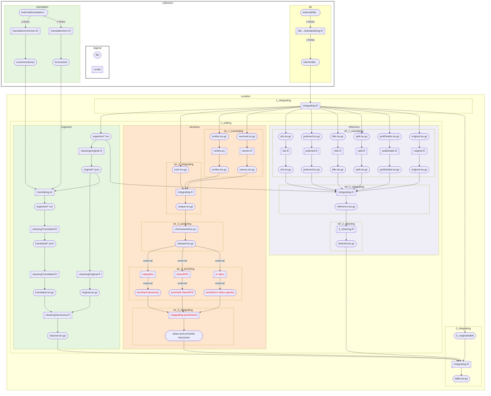

# LOTUS: a curated naturaL prOducTs occUrrences databaSe

## Abstract
*LOTUS* actually, consists of XXX'XXX referenced structure - organism pairs, collected and curated among 34 open databases (DB). 
It represents the most exhaustive open DB of natural products (NP).
It encompasses XXX'XXX distinct sanitized structures in XX’XXX resolved organisms.
Within the frame of current computational approaches to guide NP’s research, all these elements should allow a more complete understanding of organisms and their metabolites.

## Data Availability Statements
The data used to support the findings of this study have been deposited in the XXX Dataverse repository ([DOI or OTHER PERSISTENT IDENTIFIER]). 
An snapshot of the repository at the time of publication is also available.

## Dataset list
| db | initial observations| initial unique referenced structure-organism pairs| website | article | retrieval | license | contact | varia |
|:--:|:-------:|:-------:|:-------:|:-------:|:-------:|:-------:|:-------:|:-------:|
| afrotryp | 321 | 312 |  |[afrotryp_article](https://link.springer.com/article/10.1007/s00044-016-1764-y?shared-article-renderer) | [afrotryp_download](https://static-content.springer.com/esm/art%3A10.1007%2Fs00044-016-1764-y/MediaObjects/44_2016_1764_MOESM1_ESM.doc) | [article reuse conditions](https://s100.copyright.com/AppDispatchServlet?title=Binding%20of%20anti-Trypanosoma%20natural%20products%20from%20African%20flora%20against%20selected%20drug%20targets%3A%20a%20docking%20study&author=Akachukwu%20Ibezim%20et%20al&contentID=10.1007%2Fs00044-016-1764-y&publication=1054-2523&publicationDate=2017-01-11&publisherName=SpringerNature&orderBeanReset=true) | [Fidele Ntie-Kang](https://link.springer.com/article/10.1007/s00044-016-1764-y/email/correspondent/c1/new) or [Ngozi Justina Nwodo](https://link.springer.com/article/10.1007/s00044-016-1764-y/email/correspondent/c2/new) |  |
| alkamid | 4412 | 4412 | [alkamid_website](http://alkamid.ugent.be) | [alkamid_article](http://dx.doi.org/10.1016/j.jep.2012.05.038) | [alkamid_script](/src/1_gathering/db/alkamid/scraping.R) | If you are using or downloading data from the database, please cite "Boonen, J., Bronselaer, A., Nielandt, J., Veryser, L. De Tré, G., De Spiegeleer, B., 2012. Alkamid database: Chemistry, occurrence and functionality of plant N-alkylamides. Journal of Ethnopharmacology 2012; 142(3): 563-590, http://dx.doi.org/10.1016/j.jep.2012.05.038”. | [Bart.DeSpiegeleer@UGent.be](Bart.DeSpiegeleer@UGent.be) |  |
| biofacquim | 531 | 531 |[biofacquim_website](https://biofacquim.herokuapp.com) (old version) | [biofacquim_article_old](https://www.mdpi.com/2218-273X/9/1/31) [biofacquim_article_new](https://f1000research.com/articles/8-2071)| [biofacquim_download](https://ndownloader.figshare.com/files/20050244) | no license on website but article under [Creative Commons Attribution License](https://creativecommons.org/licenses/by/4.0/) | [José Medina-Franco](medinajl@unam.mx) | |
| biophytmol | 842 | 546 | [biophytmol_website](http://ab-openlab.csir.res.in/biophytmol/) | [biophytmol_article](https://jcheminf.biomedcentral.com/articles/10.1186/s13321-014-0046-2) | [biophytmol_script](/src/1_gathering/db/biophytmol/scraping.R) | If you are using this resource in your research work, please cite: Sharma et al.: BioPhytMol: a drug discovery community resource on anti-mycobacterial phytomolecules and plant extracts. Journal of Cheminformatics 2014 6:46. [Article reuse conditions](https://s100.copyright.com/AppDispatchServlet?title=BioPhytMol%3A%20a%20drug%20discovery%20community%20resource%20on%20anti-mycobacterial%20phytomolecules%20and%20plant%20extracts&author=Arun%20Sharma%20et%20al&contentID=10.1186%2Fs13321-014-0046-2&publication=1758-2946&publicationDate=2014-10-11&publisherName=SpringerNature&orderBeanReset=true) | [Anshu Bhardwaj](https://jcheminf.biomedcentral.com/articles/10.1186/s13321-014-0046-2/email/correspondent/c1/new) | website often down |
| carotenoiddb | 3361 | 2922 | [carotenoiddb_website](http://carotenoiddb.jp/About.html) | [carotenoiddb_article](https://doi.org/10.1093/database/bax004) | [carotenoiddb_script](/src/1_gathering/db/carotenoiddb/scraping.R) | Terms of use: Thank you very much for using our database. Please cite the following article when you refer. Junko Yabuzaki (2017), Carotenoids Database: structures, chemical fingerprints and distribution among organisms, DATABASE, Vol. 2017, Article ID bax004, pp.1-11, DOI: https://doi.org/10.1093/database/bax004. | [yzjunko@gmail.com](yzjunko@gmail.com) |  |
| coconut | 938151 | 385563 |[coconut_website](https://coconut.naturalproducts.net) | [coconut_article](https://jcheminf.biomedcentral.com/articles/10.1186/s13321-020-00424-9)| [coconut_download](https://zenodo.org/record/3778405/files/COCONUT.sdf.zip?download=1) | COCONUT and Natural Products Online is an open-source open-data repository for natural products. Please submit bug reports, feature requests and general issues through the issues tracker at GitHub. COCONUT and Natural Products Online are developed and maintained by the Steinbeck group at the University Friedrich-Schiller in Jena, Germany. The code for this web application is released under the MIT license. Copyright © CC-BY-SA 2020 for zenodo files: [Creative Commons Attribution 4.0 International](http://creativecommons.org/licenses/by/4.0/legalcode) | [Maria Sorokina](https://jcheminf.biomedcentral.com/articles/10.1186/s13321-020-00424-9/email/correspondent/c1/new) | [coconut_zenodo](https://zenodo.org/record/3778405#.XsylyC1Ph0Y) |
| cyanometdb | 2090 | 1930 |  | [cyanometdb_preprint](https://www.biorxiv.org/content/10.1101/2020.04.16.038703v1)| [cyanometdb_download_1](https://www.biorxiv.org/content/biorxiv/early/2020/04/16/2020.04.16.038703/DC1/embed/media-1.csv?download=true) [cyanometdb_download_2](https://www.biorxiv.org/content/biorxiv/early/2020/04/16/2020.04.16.038703/DC2/embed/media-2.csv?download=true) [cyanometdb_download_3](https://www.biorxiv.org/content/biorxiv/early/2020/04/16/2020.04.16.038703/DC2/embed/media-23.csv?download=true) | The copyright holder for this preprint is the author/funder, who has granted bioRxiv a license to display the preprint in perpetuity. It is made available under a CC-BY-NC-ND 4.0 International license. | [elisabeth.janssen@eawag.ch](elisabeth.janssen@eawag.ch) |  |
| datawarrior | 599 | 589 | [datawarrior_website](http://www.openmolecules.org/datawarrior/index.html) | [datawarrior_article](https://doi.org/10.1021/ci500588j)| [datawarrior_download](http://www.openmolecules.org/datawarrior/download.html) | © [idorsia](https://www.idorsia.com/index) | [thomas.sander@idorsia.com](thomas.sander@idorsia.com) | no real link to the dataset inside it |
| dnp | 299173 | 206829 |  |  |  | maybe to | remove from | here ? |
| drduke | 104388 | 90675 |[drduke_website](https://phytochem.nal.usda.gov/phytochem/help/index/about) || [drduke_download](https://data.nal.usda.gov/system/files/Duke-Source-CSV.zip) | How to Cite the Database Contents of this database are made available under a [Creative Commons CC0](https://creativecommons.org/publicdomain/zero/1.0/) public domain dedication. The suggested citation is: U.S. Department of Agriculture, Agricultural Research Service. 1992-2016. Dr. Duke's Phytochemical and Ethnobotanical Databases. Home Page, http://phytochem.nal.usda.gov/ http://dx.doi.org/10.15482/USDA.ADC/1239279 | [agref@usda.gov](agref@usda.gov) | not sure about contact |
| foodb | 99568 | 82415 | [foodb_website](https://foodb.ca/about#cite) | | [foodb_download](https://foodb.ca/public/system/downloads/foodb_2020_4_7_csv.tar.gz) | FooDB is offered to the public as a freely available resource. Use and re-distribution of the data, in whole or in part, for commercial purposes requires explicit permission of the authors and explicit acknowledgment of the source material (FooDB) and the original publication (see below). We ask that users who download significant portions of the database cite the FooDB paper in any resulting publications. For commerical licence, please consult with jreid3@ualberta.ca (Jennifer). Please cite: www.foodb.ca | jreid3@ualberta.ca (Jennifer) |  | 
| inflamnat | 665 | 665 |  | [inflamnat_article](https://pubs.acs.org/doi/10.1021/acs.jcim.8b00560) | [inflamnat_download](https://pubs.acs.org/doi/suppl/10.1021/acs.jcim.8b00560/suppl_file/ci8b00560_si_001.xlsx) | Rights and permissions: [here](https://s100.copyright.com/AppDispatchServlet?startPage=66&pageCount=8&copyright=American+Chemical+Society&author=Ruihan+Zhang%2C+Jing+Lin%2C+Yan+Zou%2C+et+al&orderBeanReset=true&imprint=American+Chemical+Society&volumeNum=59&issueNum=1&contentID=acs.jcim.8b00560&title=Chemical+Space+and+Biological+Target+Network+of+Anti-Inflammatory+Natural+Products&numPages=8&pa=&issn=1549-9596&publisherName=acs&publication=jcisd8&rpt=n&endPage=73&publicationDate=January+2019) | xiaoweilie@ynu.edu.cn | |
| knapsack | 117742 | 116292 | [knapsack_website](http://www.knapsackfamily.com/knapsack_core/top.php) | [knapsack_article](https://link.springer.com/chapter/10.1007/3-540-29782-0_13)| [knapsack_script](/src/1_gathering/db/knapsack/scraping.R) | CAUTION: (C) Any content included in KNApSAcK database cannot be re-distributed or used for commercial purposes by any user without contacting with KNApSAcK DB group (skanaya@gtc.naist.jp). All rights reserved. © 2007 NARA INSTITUTE of SCIENCE and TECHNOLOGY | skanaya@gtc.naist.jp | |
| metabolights | 8367 | 8258 | [metabolights_website](https://www.ebi.ac.uk/metabolights/about) | [metabolights_article](https://doi.org/10.1093/nar/gkz1019)| [metabolights_script](/src/1_gathering/db/metabolights/scraping.R) (an API exists, maybe use it if time) | Citing MetaboLights Kenneth Haug, Keeva Cochrane, Venkata Chandrasekhar Nainala, Mark Williams, Jiakang Chang, Kalai Vanii Jayaseelan, Claire O’Donovan. MetaboLights: a resource evolving in response to the needs of its scientific community. Nucleic Acids Research, gkz1019, doi:10.1093/nar/gkz1019, PMID:31691833. Licensing All data is governed by the EMBL-EBI's [Terms of use](http://www.ebi.ac.uk/about/terms-of-use) and all [code](https://github.com/EBI-Metabolights) is licensed under [Apache 2.0](http://www.apache.org/licenses/LICENSE-2.0). | ??? |  |
| mibig | 1340 | 1310 | [mibig_website](https://mibig.secondarymetabolites.org) | [mibig_article](https://doi.org/10.1093/nar/gkz882) | [mibig_download](https://dl.secondarymetabolites.org/mibig/mibig_json_2.0.tar.gz) | Comments or questions on MIBiG? Please do not hesitate to contact us. This work is licensed under a [Creative Commons Attribution 4.0 International License](http://creativecommons.org/licenses/by/4.0/). If you found MIBiG useful, please cite Kautsar, Blin, et al. Nucl. Acids. Res. gkz882, doi: 10.1093/nar/gkz882. | [Tilmann Weber](tiwe@biosustain.dtu.dk) marnix.medema@wur.nl |  |
| mitishambadb | 1102 | 1052 | [mitishamba_website](http://mitishamba.uonbi.ac.ke) | [mitishamba_"article"](http://erepository.uonbi.ac.ke/handle/11295/92273)| [mitishamba_script](/src/1_gathering/db/mitishamba/scraping.R) | © 2014 University of Nairobi. All rights reserved. | ??? |  |
| nanpdb | 5777 | 5752 | [nanpdb_website](http://african-compounds.org/nanpdb/) | [nanpdb_article](https://doi.org/10.1021/acs.jnatprod.7b00283) | [nanpdb_script](/src/1_gathering/db/nanpdb/scraping.R) | To cite NANPDB, please reference: NANPDB: A Resource for Natural Products from Northern African Sources Fidele Ntie-Kang, Kiran K. Telukunta, Kersten Döring, Conrad V. Simoben, Aurélien F. A. Moumbock, Yvette I. Malange, Leonel E. Njume, Joseph N. Yong, Wolfgang Sippl, and Stefan Günther Journal of Natural Products DOI: 10.1021/acs.jnatprod.7b00283 | ntiekfidele@gmail.com stefan.guenther@pharmazie.uni-freiburg.de |  |
| napralert | xxx | xxx | @bjo | please | fill |  |  |  |
| npass | 298114 | 33371 | [npass_website](http://bidd2.nus.edu.sg/NPASS/about.php) | [npass_article](https://academic.oup.com/nar/article/46/D1/D1217/4584628) | [npass_download](http://bidd.group/NPASS/downloadnpass.html) | Note: This article is available under the Creative Commons CC-BY-NC license and permits non-commercial use, distribution and reproduction in any medium, provided the original work is properly cited. If you use the database in your research, please cite: Xian Zeng, Peng Zhang, Weidong He, Chu Qin, Shangying Chen, Lin Tao, Yali Wang, et al. NPASS: natural product activity and species source database for natural product research, discovery and tool development Nucleic Acids Research, 2018, 46(D1):D1217-D1222. PMID:29106619 No copyright | phacyz@nus.edu.sg jiangyy@sz.tsinghua.edu.cn iaochen@163.com |  |
| npatlas | 29006 | 29006 | [npatlas_website](https://www.npatlas.org/joomla/) | [npatlas_article](https://doi.org/10.1021/acscentsci.9b00806) | [npatlas_download](https://www.npatlas.org/custom/versions/np_atlas_2020_06/NPAtlas_download.tsv) | van Santen, J. A.; Jacob, G.; Leen Singh, A.; Aniebok, V.; Balunas, M. J.; Bunsko, D.; Carnevale Neto, F.; Castaño-Espriu, L.; Chang, C.; Clark, T. N.; Cleary Little, J. L.; Delgadillo, D. A.; Dorrestein, P. C.; Duncan, K. R.; Egan, J. M.; Galey, M. M.; Haeckl, F. P. J.; Hua, A.; Hughes, A. H.; Iskakova, D.; Khadilkar, A.; Lee, J.-H.; Lee, S.; LeGrow, N.; Liu, D. Y.; Macho, J. M.; McCaughey, C. S.; Medema, M. H.; Neupane, R. P.; O’Donnell, T. J.; Paula, J. S.; Sanchez, L. M.; Shaikh, A. F.; Soldatou, S.; Terlouw, B. R.; Tran, T. A.; Valentine, M.; van der Hooft, J. J. J.; Vo, D. A.; Wang, M.; Wilson, D.; Zink, K. E.; Linington, R. G.* "The Natural Products Atlas: An Open Access Knowledge Base for Microbial Natural Products Discovery”, ACS Central Science, 2019, 5, 11, 1824-1833. 10.1021/acscentsci.9b00806 The Natural Products Atlas is licensed under a Creative Commons Attribution 4.0 International License. | rliningt@sfu.ca |  |
| npcare | 23495 | 7763 | [npcare_website](http://silver.sejong.ac.kr/npcare/) | [npcare_article](https://doi.org/10.1186/s13321-016-0188-5) | [npcare_download](http://silver.sejong.ac.kr/npcare/csv/npcare.zip) | Open Access This article is distributed under the terms of the Creative Commons Attribution 4.0 International License (http://creativecommons.org/licenses/by/4.0/), which permits unrestricted use, distribution, and reproduction in any medium, provided you give appropriate credit to the original author(s) and the source, provide a link to the Creative Commons license, and indicate if changes were made. The Creative Commons Public Domain Dedication waiver (http://creativecommons.org/publicdomain/zero/1.0/) applies to the data made available in this article, unless otherwise stated. Contact us at Department of Bioscience and Biotechnology [Sejong University](http://eng.sejong.ac.kr/) Copyright © 2016 Department of Bioscience and Biotechnology, Sejong University | choihwanho@gmail.com |  |
| npedia | 83848 | 82 |[npedia_website](http://www.cbrg.riken.jp/npedia/?LANG=en) | [npedia_"article"](https://www.jstage.jst.go.jp/article/ciqs/2006/0/2006_0_JL6/_article) | [npedia_script](/src/1_gathering/db/npedia/scraping.R) | Nothing?? | hisyo@riken.jp, npd@riken.jp |  |
| nubbe | 3262 | 2189 |[nubbe_website](https://nubbe.iq.unesp.br/portal/nubbe-search.html) | [nubbe_article](https://www.nature.com/articles/s41598-017-07451-x) | [MISSING_nubbe_script](/src/1_gathering/db/nubbe/scraping.R) | To cite NuBBEDB, please reference: Valli, M.; dos Santos, R.N.; Figueira, L.D.; Nakajima, C.H.; Andricopulo, A.D.; Bolzani, V.S. Development of a Natural Products Database from the Biodiversity of Brazil. Journal of Natural Products, 76(3), 439-444, 2013. Pilon, A. C.; Valli, M.; Dametto, A. C.; Pinto, M. E. F.; Freire, R. T.; Castro-Gamboa, I.; Andricopulo, A. D.; Bolzani, V. S. NuBBEDB: an updated database to uncover chemical and biological information from Brazilian biodiversity. Scientific Reports, 7, 7215, 2017. LICENSE: THE WORK (AS DEFINED BELOW) IS PROVIDED UNDER THE TERMS OF THIS CREATIVE COMMONS PUBLIC LICENSE ("CCPL" OR "LICENSE"). THE WORK IS PROTECTED BY COPYRIGHT AND/OR OTHER APPLICABLE LAW. ANY USE OF THE WORK OTHER THAN AS AUTHORIZED UNDER THIS LICENSE OR COPYRIGHT LAW IS PROHIBITED. BY EXERCISING ANY RIGHTS TO THE WORK PROVIDED HERE, YOU ACCEPT AND AGREE TO BE BOUND BY THE TERMS OF THIS LICENSE. TO THE EXTENT THIS LICENSE MAY BE CONSIDERED TO BE A CONTRACT, THE LICENSOR GRANTS YOU THE RIGHTS CONTAINED HERE IN CONSIDERATION OF YOUR ACCEPTANCE OF SUCH TERMS AND CONDITIONS. | [Vanderlan S. Bolzani](https://www.nature.com/articles/s41598-017-07451-x/email/correspondent/c1/new) |  |
| pamdb | 3065 | 3061 | [pamdb_website](http://pseudomonas.umaryland.edu/PAMDB.htm) | [pamdb_article](https://academic.oup.com/nar/article-lookup/doi/10.1093/nar/gkx1061) | [pamdb_download](http://pseudomonas.umaryland.edu/PaDl/PaMet.xlsx) | PAMDB is offered to the public as a freely available resource for academic purposes. Please cite the PAMDB paper in any resulting publications. Citing PAMDB : Weiliang Huang, Luke K. Brewer, Jace W. Jones, Angela T. Nguyen, Ana Marcu, David S. Wishart, Amanda G. Oglesby-Sherrouse, Maureen A. Kane, and Angela Wilks (2018). PAMDB: a comprehensive Pseudomonas aeruginosa metabolome database. Nucleic Acids Res. 46(D1):D575-D580. PMID: 29106626 DOI: 10.1093/nar/gkx1061 | awilks@rx.umaryland.edu aoglesby@rx.umaryland.edu mkane@rx.umaryland.edu |  |
| phenolexplorer | 11807 | 8968 |[phenolexplorer_website](http://phenol-explorer.eu/cite_us) | [phenolexplorer_article](http://database.oxfordjournals.org/content/2013/bat070.long) | [phenolexplorer_download](http://phenol-explorer.eu/downloads) | Phenol-Explorer is offered to the public as a freely available resource. Use and re-distribution of the data, in whole or in part, for commercial purposes requires explicit permission of the authors and explicit acknowledgment of the source material (Phenol-Explorer) and the original publications (see below). We ask that users who download significant portions of the database cite the Phenol-Explorer papers in any resulting publications. How to cite us Neveu V, Perez-Jiménez J, Vos F, Crespy V, du Chaffaut L, Mennen L, Knox C, Eisner R, Cruz J, Wishart D, Scalbert A. (2010) Phenol-Explorer: an online comprehensive database on polyphenol contents in foods. Database, doi: 10.1093/database/bap024. Full text (free access) Rothwell JA, Urpi-Sarda M, Boto-Ordoñez M, Knox C, Llorach R, Eisner R, Cruz J, Neveu V, Wishart D, Manach C, Andres-Lacueva C, Scalbert A. (2012) Phenol-Explorer 2.0: a major update of the Phenol-Explorer database integrating data on polyphenol metabolism and pharmacokinetics in humans and experimental animals. Database, doi: 10.1093/database/bas031. Full text (free access) Rothwell JA, Pérez-Jiménez J, Neveu V, Medina-Ramon A, M'Hiri N, Garcia Lobato P, Manach C, Knox K, Eisner R, Wishart D, Scalbert A. (2013) Phenol-Explorer 3.0: a major update of the Phenol-Explorer database to incorporate data on the effects of food processing on polyphenol content. Database, 10.1093/database/bat070. Full text (free access) | scalberta@iarc.fr |  |
| phytohub | 2802 | 2363 | [phytohub_website](http://phytohub.eu/about) | [phytohub_"article"](https://hal.archives-ouvertes.fr/hal-01697081/file/2017_Giacomoni_ICPH_Québec.pdf)| [phytohub_script](/src/1_gathering/db/phytohub/scraping.R) | No info? | claudine.manach@inra.fr |  |
| procardb | 6881 | 6606 | [procardb_website](https://bioinfo.imtech.res.in/servers/procardb/) | [procardb_article](https://bmcmicrobiol.biomedcentral.com/articles/10.1186/s12866-016-0715-6) | [procardb_script](/src/1_gathering/db/procardb/scraping.R) | Open Access This article is distributed under the terms of the Creative Commons Attribution 4.0 International License (http://creativecommons.org/licenses/by/4.0/), which permits unrestricted use, distribution, and reproduction in any medium, provided you give appropriate credit to the original author(s) and the source, provide a link to the Creative Commons license, and indicate if changes were made. The Creative Commons Public Domain Dedication waiver (http://creativecommons.org/publicdomain/zero/1.0/) applies to the data made available in this article, unless otherwise stated. Please cite: Nupur, Vats A, Dhanda SK, Raghava GPS, Pinnaka A, Kumar A (2016):"ProCarDB: a database of bacterial carotenoids"; BMC Microbiology 16(96) © IMTECH Sept 2015. | [Anil Kumar Pinnaka](https://bmcmicrobiol.biomedcentral.com/articles/10.1186/s12866-016-0715-6/email/correspondent/c1/new) [Ashwani Kumar](https://bmcmicrobiol.biomedcentral.com/articles/10.1186/s12866-016-0715-6/email/correspondent/c2/new) |  |
| respect | 3636 | 2759 | [respect_website](http://spectra.psc.riken.jp/menta.cgi/respect/licence/licence) | [respect_article](https://www.sciencedirect.com/science/article/pii/S003194221200310X) | [respect_download](http://spectra.psc.riken.jp/menta.cgi/static/respect/respect.zip) | This work is licensed under a [Creative Commons Attribution - Noncommercial 2.1 Japan License](http://creativecommons.org/licenses/by-nc/2.1/jp/deed.en). This website (http://spectra.psc.riken.jp/) is managed by RIKEN Center for Sustainable Resource Science. The legal title to all data in this website remains in RIKEN. Any person who accesses and uses this website should note and agree the following terms and conditions prior to using this website. The information is not provided for commercial use. If the information is intended to use for commercial application, please contact us. | ksaito@psc.riken.jp | |
| sancdb | 2864 | 862 | [sancdb_website](https://sancdb.rubi.ru.ac.za/cite_us/) | [sancdb_article](https://jcheminf.biomedcentral.com/articles/10.1186/s13321-015-0080-8) | [sancdb_script](/src/1_gathering/db/sancdb/scraping.R) | Open Access This article is distributed under the terms of the Creative Commons Attribution 4.0 International License (http://creativecommons.org/licenses/by/4.0/), which permits unrestricted use, distribution, and reproduction in any medium, provided you give appropriate credit to the original author(s) and the source, provide a link to the Creative Commons license, and indicate if changes were made. The Creative Commons Public Domain Dedication waiver (http://creativecommons.org/publicdomain/zero/1.0/) applies to the data made available in this article, unless otherwise stated. If you use SANCDB in your research, please cite the following article: J Cheminform. 2015 Jun 19;7:29. doi: 10.1186/s13321-015-0080-8. eCollection 2015. | [Özlem Tastan Bishop](https://jcheminf.biomedcentral.com/articles/10.1186/s13321-015-0080-8/email/correspondent/c1/new) |  |
| streptomedb | 71792 | 71638 | [streptomedb_website](http://132.230.56.4/streptomedb3/) | [streptomedb_article](https://doi.org/10.1093/nar/gkv1319) | [streptomedb_download](http://132.230.56.4/streptomedb/download/) | StreptomeDB 2.0—an extended resource of natural products produced by streptomycetes. Klementz D, Döring K, Lucas X, Telukunta KK, Erxleben A, Deubel D, Erber A, Santillana I, Thomas OS, Bechthold A, Günther S. Nucleic Acids Res., 2016, 44, D509-514. DOI: 10.1093/nar/gkv1319. [legal info](http://www.pharmbioinf.uni-freiburg.de/contact/impressum/) 3.Copyright The Pharmaceutical Bioinformatics lab intended not to use any copyrighted material for the publication or, if not possible, to indicate the copyright of the respective object. The copyright for any material created by the Pharmaceutical Bioinformatics lab is reserved. Any duplication or use of objects such as texts or diagrams, in other electronic or printed publications is not permitted without the Pharmaceutical Bioinformatics lab prior agreement | stefan.guenther@pharmazie.uni-freiburg.de | |
| swmd | 1077 | 1075 | [swmd_website](http://www.swmd.co.in/index.php) | [swmd_article](https://dx.doi.org/10.6026%2F97320630005361) | [swmd_script](/src/1_gathering/db/swmd/scraping.R) | This is an Open Access article which permits unrestricted use, distribution, and reproduction in any medium, provided the original work is properly credited. This is distributed under the terms of the Creative Commons Attribution License. Citation: Davis & Vasanthi, Seaweed metabolite database (SWMD): A database of natural compounds from marine algae, Bioinformation 5(8): 361-364 (2011) | Dicky.John@gmail.com |  |
| tmdb | 2273 | 2145 | [tmdb_website](http://pcsb.ahau.edu.cn:8080/TCDB/index.jsp) | [tmdb_article](https://bmcplantbiol.biomedcentral.com/articles/10.1186/s12870-014-0243-1) | [tmdb_script](/src/1_gathering/db/tmdb/scraping.R) | [reuse permission](https://s100.copyright.com/AppDispatchServlet?title=TMDB%3A%20A%20literature-curated%20database%20for%20small%20molecular%20compounds%20found%20from%20tea&author=Yi%20Yue%20et%20al&contentID=10.1186%2Fs12870-014-0243-1&publication=1471-2229&publicationDate=2014-09-16&publisherName=SpringerNature&orderBeanReset=true) | [Xiao-Chun Wan](https://bmcplantbiol.biomedcentral.com/articles/10.1186/s12870-014-0243-1/email/correspondent/c1/new) [Guan-Hu Bao](https://bmcplantbiol.biomedcentral.com/articles/10.1186/s12870-014-0243-1/email/correspondent/c2/new) | currently down |
| tmmc | 15079 | 15033 | [tmmc_website](http://informatics.kiom.re.kr/compound/index.jsp) | [tmmc_article](https://bmccomplementmedtherapies.biomedcentral.com/articles/10.1186/s12906-015-0758-5) | [tmmc_download](http://informatics.kiom.re.kr/compound/download/compound.xlsx) | [reuse permission](https://s100.copyright.com/AppDispatchServlet?title=TM-MC%3A%20a%20database%20of%20medicinal%20materials%20and%20chemical%20compounds%20in%20Northeast%20Asian%20traditional%20medicine&author=Sang-Kyun%20Kim%20et%20al&contentID=10.1186%2Fs12906-015-0758-5&publication=1472-6882&publicationDate=2015-07-09&publisherName=SpringerNature&orderBeanReset=true) no other info | [Jeong-Ju Lee](https://bmccomplementmedtherapies.biomedcentral.com/articles/10.1186/s12906-015-0758-5/email/correspondent/c1/new) |  |
| tppt | 27487 | 27182 | [tppt_website](https://www.agroscope.admin.ch/agroscope/en/home/publications/apps/tppt.html) | [tppt_article](https://pubs.acs.org/doi/10.1021/acs.jafc.8b01639) | [tppt_download](https://www.agroscope.admin.ch/dam/agroscope/de/dokumente/publikationen/tppt-xls.xlsx.download.xlsx/TPPT_database.xlsx) | [reuse permission](https://pubs.acs.org/page/copyright/permissions.html) | thomas.bucheli@agroscope.admin.ch | |
| unpd | 423432 | 340319 | [unpd_website](https://web.archive.org/web/20160314180639/http://pkuxxj.pku.edu.cn/UNPD/introduction.php) | [unpd_article](https://journals.plos.org/plosone/article?id=10.1371/journal.pone.0062839) | [NICE_QUESTION](NO_IDEA) | Jiangyong Gu, Yuanshen Gui, Lirong Chen, Gu Yuan, Hui-Zhe Lu, Xiaojie Xu. Use of Natural Products as Chemical Library for Drug Discovery and Network Pharmacology. PLoS ONE. 2013, 8(4): e62839. doi:10.1371/journal.pone.0062839. | lirongc@pku.edu.cn xiaojxu@pku.edu.cn |  | 
| wakankensaku | 367 | 367 | [wakankensaku_website](https://wakankensaku.inm.u-toyama.ac.jp/wiki/Main_Page) | ??? | [wakankensaku_script](/src/1_gathering/db/wakankensaku/scraping.R) | ??? | ??? | |

## Computational requirements
see https://social-science-data-editors.github.io/guidance/template-README.html
### Software Requirements
### Description of programs
### Memory and Runtime Requirements

## Instructions
### Details

## List of tables and programs

## References

## Acknowledgments
* Hat tip to anyone whose code was used
* Inspiration
* etc.


## Flowchart


## Getting Started
These instructions will get you a copy of the project up and running on your local machine for development and testing purposes.

### Prerequisites
You need:
- Git
- [DVC](https://www.dvc.org).

You need to have access to the metabomaps server to be able to pull the data, if you don't you will have to pull all the DBs data
from scratch.

### Access to metabomaps
Add this to your
```
 ~/.ssh/config
```

```
Host metabomaps
  IdentityFile /home/<user_local>/.ssh/id_rsa_metabomaps
  User <user_remote>
  HostName metabomaps.nprod.net
  Port 10311
```

### Pull the repository
```console
git pull https://gitlab.unige.ch/Adriano.Rutz/opennaturalproductsdb.git

# If you need the data
dvc pull  # This will take a while
```

### Having the data in a different place
If you want to have the data in a different place (for example for running a test), you can set the environment variable **DATA_PATH**.

### If you want to build only a simple DB
make -C src/1_gathering/db -B alkamid 

### Use docker to build
Install docker on your machine, make sure it is on your path

then

````console
make docker-build
make docker-bash
````

This will bring you in a container that will already have all the dependencies installed so you can run your commands in it.

### Packages
#### Conda environement

A "loose" environment.yml file is created and should allow to recreate a working env formthe project without beeing too restrictive on the versions to install. Install it by running in the home directory. 

We will also create another environment for strict mirroring of the installed packages. (TO DO)

````
conda env create -f environment.yml
````

If your environement is not directly sources by your default bash run the following lines

````
$ source ~/anaconda3/etc/profile.d/conda.sh

$ conda activate your_env
````

Your R working directory should be src

````
$ cd src
````

If you are using Visual Studio be sure to set your R path in the settings option to reflect your created conda environment.

## Minimal working example
A minimal working example containing XXX entries coming from various DB's is proposed.
Use this example to check if all steps are running correctly on your machine.

## To build a graph from the make
(Requires remake and gprof2dot https://github.com/jrfonseca/gprof2dot)

```
remake --profile -B curating
gprof2dot -f callgrind callgrind.out.50802 | dot -Tpng -o output_full.png

```

### Description
The minimal working example file contains following columns:

# TO UPDATE

```
Give an example
```

### Final output
If everything went well, the output of the minimal working example should be:

# TO UPDATE

```
Give an example 
```

## Explanations
Add additional notes 

## Contributing
Please read [CONTRIBUTING.md](CONTRIBUTING.md) for details on our code of conduct, and the process for submitting pull requests to us.

## Authors
* **Adriano Rutz** - *Initial work* - [Adriano.Rutz](https://gitlab.unige.ch/Adriano.Rutz)
* **Pierre-Marie Allard** - *Investigator* - [Pierre-Marie.Allard](https://gitlab.unige.ch/Pierre-Marie.Allard)
* **Jonathan Bisson** - *Hacker in Chief* - [bjo](https://gitlab.unige.ch/bjo)

See also the list of [contributors](https://gitlab.unige.ch/Adriano.Rutz/opennaturalproductsdb/-/project_members) who participated in this project.

## License
This project is licensed under the GNU GPLv3 license - see the [LICENSE.md](LICENSE.md) file for details
